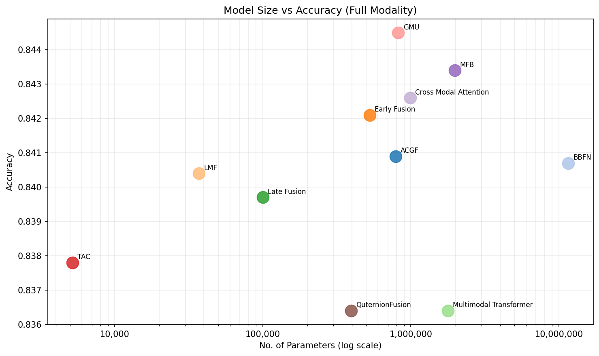
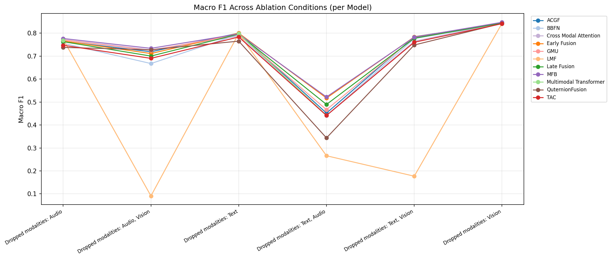

<div align="center">

# Multimodal Prediction of Conversational Dynamics

### Turn-Taking, Backchanneling, and Listening from Text, Audio, and Video

*Author:* **Ankit Navrang Meshram** &nbsp;·&nbsp; *Supervisor:* Dr. Mudasir Ahmad Ganaie  
Indian Institute of Technology Ropar &nbsp;·&nbsp; May 2026

[](https://www.python.org/)
[](https://pytorch.org/)
[](https://huggingface.co/transformers/)
[](#)

</div>

---

## TL;DR

> When a person is talking with you, your brain decides what to do next — *keep listening, nod, or take the floor* — in about **200 ms**. Voice assistants take **700 ms** of silence to decide. This work closes that gap by predicting the listener's next action from **text + audio + video simultaneously**, and shows that a fusion module with just **5,173 parameters** can match models 159× its size.

| Metric                                   | Best baseline (GMU) | **Proposed (TAC)**              |
| ---------------------------------------- | ------------------: | ------------------------------: |
| Fusion parameters                        |             821,251 |                       **5,173** |
| Macro-F1 (tri-modal)                     |              0.8607 |                          0.8523 |
| Performance gap                          |                   — |              −0.84% absolute    |
| Parameter reduction                      |                   — |                    **158.8×**   |
| Robust to missing modalities             |                  ✅ |                            ✅   |
| Robust to **two** missing modalities     |          ⚠️ partial |                            ✅   |

LMF (the prior parameter-efficient baseline) collapses to **below random chance (0.09 Macro-F1)** under missing-modality conditions. TAC and ACGF (the proposed methods) do not.

📄 **Read the thesis:** [`docs/thesis.pdf`](docs/thesis.pdf) &nbsp;·&nbsp; 🎞️ **Slides:** [`docs/presentation.pdf`](docs/presentation.pdf) &nbsp;·&nbsp; 📊 **Full results:** [`docs/results.md`](docs/results.md)

---

## The problem

Human conversation is multimodal and predictive. Listeners track **linguistic, prosodic, and visual** cues *in parallel* to project when a turn is about to end and what response (continue listening, backchannel, take the floor) is appropriate. Modern voice assistants are reactive — they wait for a silence threshold and miss this entire layer of communication.

The MM-F2F dataset (Lin et al., 2025) frames this as a three-class problem at every word boundary in a conversation:

- **KEEP**  — speaker continues; listener stays silent  
- **TURN**  — turn-taking; listener takes the floor  
- **BC**    — backchannel; listener emits brief feedback ("mm-hmm", a nod)

This repo benchmarks **13 multimodal fusion architectures** on that task — 9 standard baselines, BBFN, Quaternion Fusion, and two proposed mechanisms — and identifies a theoretical limitation shared by all of them.

---

## The contribution

### 1. The positive-correlation ceiling

Every existing fusion mechanism — Hadamard-product methods (LMF, TFN), dot-product attention (Cross-Attn, MulT), gated/additive (GMU, Early, Late, MFB, BBFN) — is designed to **amplify modality agreement** and discard modality conflict. That's a problem because conflict is exactly when fusion matters most:

```
            text: "I'll be done in a second"   →  signals TURN
           audio: rising pitch contour          →  signals KEEP
           video: sustained gaze on listener    →  signals KEEP

  agreement-only fusion:  averages these into mush  →  ambiguous
   conflict-aware fusion: encodes the disagreement   →  predicts KEEP
```

### 2. Signed difference vectors

The two proposed modules add a new feature alongside the standard agreement pathway: **signed pairwise differences** between modality embeddings.

```python
d_TA = z_text  - z_audio    # who weights this feature more, and by how much
d_TV = z_text  - z_video
d_AV = z_audio - z_video
```

The **sign** encodes *which* modality dominates each dimension; the **magnitude** encodes *how strongly* they disagree. Hadamard and dot products both throw this directional information away.

### 3. Two architectures

| Module    | Params  | Tri-modal Mac-F1 | Headline                                                    |
| --------- | ------: | ---------------: | ----------------------------------------------------------- |
| **ACGF**  | 788,483 |           0.8573 | Dual streams (agreement + conflict) + learned routing gate. |
| **TAC**   |   5,173 |           0.8523 | Same idea, distilled to parameter-free element-wise ops.    |

Both degrade gracefully under sensor dropout — an absent modality becomes a *maximum-discrepancy signal* the conflict pathway can use, instead of zeroing the entire representation.

---

## Headline results

📊 *Full tables, per-class F1, parameter counts, and ablation conditions are in [`docs/results.md`](docs/results.md).*

### Parameter count vs. accuracy (no correlation)

<div align="center">



*TAC (5K) beats MulT (1.78M) and Quaternion Fusion (395K).*

</div>

### Robustness under sensor dropout

<div align="center">



*LMF (orange) collapses below random chance when modalities are missing. Every other method — including the proposed ACGF and TAC — degrades gracefully.*

</div>

### Final tri-modal benchmark

| Rank | Method            | Params      | Macro-F1   |
| :---: | ---------------- | ----------: | ---------: |
| 1    | GMU (baseline)    |     821,251 | **0.8607** |
| 5    | **ACGF** (ours)   |     788,483 |     0.8573 |
| 7    | LMF               |      37,027 |     0.8558 |
| 10   | **TAC** (ours)    | **5,173**   |     0.8523 |
| 11   | Quaternion Fusion |     395,011 |     0.8482 |

See [`docs/results.md`](docs/results.md) for all 13 methods, the parameter-efficiency frontier, and the full missing-modality ablation grid.

---

## Repo layout

```
multimodal-conversational-dynamics/
├── README.md                ← you are here
├── requirements.txt
│
├── docs/
│   ├── thesis.pdf           ← full thesis manuscript
│   ├── presentation.pdf     ← defence slide deck
│   ├── architecture.md      ← code-oriented architecture walkthrough
│   └── results.md           ← all benchmark tables
│
├── src/
│   ├── encoders.py          ← GPT-2 / HuBERT / VideoMAE wrappers
│   ├── model.py             ← LanguageAudioVisionModel
│   ├── dataloader.py        ← MM-F2F Dataset + collate_fn
│   ├── utils.py             ← metrics, formatting, label helpers
│   └── fusion/
│       ├── __init__.py      ← FUSION_REGISTRY + get_fusion_module
│       ├── baselines.py     ← LMF, Early, Late, TFN, MFB, MulT, GMU, …
│       ├── bbfn.py          ← Bi-Bimodal Fusion Network
│       ├── quaternion.py    ← Hamilton-product fusion
│       └── proposed.py      ← ★ ACGF + TAC (the contributions)
│
├── scripts/
│   ├── train_unimodal.py    ← Stage 1
│   ├── train_fusion.py      ← Stage 2
│   ├── evaluate.py          ← tri-modal evaluation
│   ├── evaluate_ablation.py ← missing-modality evaluation
│   ├── inference.py         ← end-to-end demo (WhisperX + face crop)
│   ├── extract_features.py  ← optional feature pre-caching
│   └── make_plots.py        ← regenerate all figures from all_results.xlsx
│
├── data/
│   ├── README.md            ← dataset layout + download instructions
│   ├── curate_audio_clips.py
│   └── extract_face.py
│
├── results/
│   ├── all_results.xlsx     ← consolidated benchmark spreadsheet
│   ├── tri_modal/           ← per-method full-modality results (.txt)
│   ├── ablation/            ← per-method missing-modality results
│   └── dncc_ensemble/       ← NCL ensemble extension results
│
└── figures/
    └── plot{1..10}_*.png    ← all figures from the thesis
```

---

## Reproducing the results

### 1. Setup

```bash
git clone https://github.com/<you>/multimodal-conversational-dynamics.git
cd multimodal-conversational-dynamics
python -m venv .venv && source .venv/bin/activate
pip install -r requirements.txt
```

### 2. Get the data

The MM-F2F annotations live on Google Drive / Baidu — see [`data/README.md`](data/README.md) for the links, the directory layout, and how to run the audio / face-frame extraction scripts. The raw audio + video files are **not** in this repo; you build them locally from the YouTube source videos.

Expected on-disk layout after preprocessing:

```
dataset/
├── train.csv   val.csv   test.csv        # tab-separated annotations
├── audio/<video_id>/<sentence_id>.mp3
└── video/<video_id>/<sentence_id>/{0..15}.jpg
```

### 3. Pretrained checkpoints

Stage 1 checkpoints (text / audio / video encoders) and the Stage 2
fusion checkpoints are too large for git. Two options:

- **Train your own** — both stages run end-to-end on a single GPU; Stage 1 takes ~10 epochs at lr `1e-5`, Stage 2 likewise.
- **Download** — pretrained `.pt` files will be released on Hugging Face Hub. Drop a link here once published:

```
text_model.pt   →  <hf-hub URL>
audio_model.pt  →  <hf-hub URL>
vision_model.pt →  <hf-hub URL>
<fusion>.pt     →  <hf-hub URL>
```

### 4. Stage 1 — uni-modal encoder training

```bash
python -m scripts.train_unimodal --modal text  --data_root dataset/ --batch_size 16
python -m scripts.train_unimodal --modal audio --data_root dataset/ --batch_size 8
python -m scripts.train_unimodal --modal video --data_root dataset/ --batch_size 4
```

Each run writes a TensorBoard log to `log/<timestamp>_<modality>/` and a checkpoint per epoch.

### 5. Stage 2 — fusion training

```bash
python -m scripts.train_fusion \
    --t_ckpt_path log/<text_run>/epoch_9.pt \
    --a_ckpt_path log/<audio_run>/epoch_9.pt \
    --v_ckpt_path log/<video_run>/epoch_9.pt \
    --fusion_module ACGF \
    --data_root dataset/ \
    --batch_size 8 --n_epoch 10
```

Swap `--fusion_module ACGF` for any of:

```
LMF | Early_Fusion | Late_Fusion | TFN | MFB | Cross_Modal_Attention
GMU | Multimodal_Transformer | Tucker_Fusion | BBFN | Quaternion_Fusion
ACGF | TAC
```

### 6. Evaluation

```bash
# Full tri-modal
python -m scripts.evaluate \
    --model_weights log/<run>/epoch_9.pt \
    --fusion_module ACGF \
    --data_root dataset/

# Missing-modality ablation (drop video)
python -m scripts.evaluate_ablation \
    --model_weights log/<run>/epoch_9.pt \
    --fusion_module ACGF \
    --drop_vision
```

### 7. Regenerate figures

```bash
python -m scripts.make_plots
```

### 8. End-to-end inference on a raw video

```bash
pip install whisperx batch-face            # additional inference-only deps
python -m scripts.inference \
    --input_path  example/demo.mp4 \
    --ckpt_path   log/<run>/epoch_9.pt \
    --fusion_module ACGF
```

---

## Citation

If you use any of this code or the proposed ACGF / TAC architectures, please cite:

```bibtex
@mastersthesis{meshram2026multimodal,
  title  = {Multimodal Prediction of Conversational Dynamics:
            Turn-Taking, Backchanneling, and Listening using
            Text, Audio, and Visual Signals},
  author = {Meshram, Ankit Navrang},
  school = {Indian Institute of Technology Ropar},
  year   = {2026},
  type   = {{M.Tech.} Thesis},
}
```

The MM-F2F dataset:

```bibtex
@inproceedings{lin2025mmf2f,
  title     = {{MM-F2F}: A Multimodal Face-to-Face Conversation Dataset},
  author    = {Lin, Yuxuan and others},
  booktitle = {Proceedings of …},
  year      = {2025}
}
```

---

## License

License has not been finalised yet. **Until a `LICENSE` file is added at the repo root, all rights are reserved by the author.** Contact for permission to reuse.

---

## Acknowledgements

This work builds on the **MM-F2F** dataset by Lin et al. (2025). The
encoder backbones use pretrained checkpoints from
[Hugging Face](https://huggingface.co/): GPT-2 (OpenAI), HuBERT (Meta),
and VideoMAE (MCG-NJU). The benchmark covers fusion mechanisms from
Liu et al. (LMF, 2018), Zadeh et al. (TFN, 2017), Yu et al. (MFB, 2017),
Arevalo et al. (GMU, 2017), Tsai et al. (MulT, 2019), Han et al. (BBFN, 2021),
and related work.

Supervised by **Dr. Mudasir Ahmad Ganaie**, Department of Computer Science &
Engineering, IIT Ropar.
